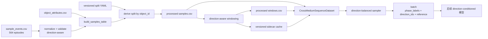

# 双向跨介质数据管线改造说明

> 文档状态：评审版 v1  
> 改造范围：原始事件表读取、标注校验、预处理、窗口与 sidecar 生成、split 派生、Reference 构建、Dataset/Batch 字段、采样器、缓存与测试  
> 暂不包含：模型结构、direction embedding、损失函数和训练阶段权重调整

---

## 1. 改造目标

当前数据管线按单向 Water-to-Air（W2A）实现，核心代码默认：

```text
界面前 = Water
界面后 = Air
Reference = 界面前 Water 稳定窗口
```

加入 Air-to-Water（A2W）后，上述固定假设不再成立。本次改造需要将方向、源介质、目标介质和 Reference 介质从原始事件表一直传递到预处理输出、sidecar、Dataset 和 batch，并保证：

1. W2A 时序为 `Water -> Interface -> Air`；
2. A2W 时序为 `Air -> Interface -> Water`；
3. Direction 与 Medium Phase 是两个独立变量；
4. Reference 始终来自源介质中的界面前区间；
5. A2W 不伪造 `t_contact_all` 或 `t_grasp_stable`；
6. fail episode 保留在原始及预处理数据中，但不生成 Policy/Reference 监督；
7. split 继续以 YAML 中的 object-level 划分为唯一真值来源；
8. 旧 W2A 处理结果可回归验证，新旧缓存不能混用；
9. 数据层为后续 direction-conditioned 模型提供稳定、显式、可审计的输入。

---

## 2. 已确认的数据约定

| 项目 | 最终约定 |
|---|---|
| Direction 枚举 | `W2A`、`A2W` |
| 原始介质枚举 | `water`、`air` |
| 模型 Phase 枚举 | `Water`、`Interface`、`Air`，保持现有索引兼容 |
| W2A | `source_medium=water`，`target_medium=air` |
| A2W | `source_medium=air`，`target_medium=water` |
| Reference medium | 始终等于 `source_medium` |
| Physical identity | 相同 `OBJxxx` 在两个方向中是同一件实物 |
| Physical UID | `VT_OBJxxx` |
| A2W 起始状态 | 从 `t=0` 起已经稳定抓住物体并位于空中 |
| A2W contact/stable 事件 | `t_contact_all`、`t_grasp_stable` 允许为空，不补伪标签 |
| 同步 | A2W 已硬件同步，`sync_offset_sec=0`、`sync_audit_status=verified_zero` |
| Reference 统计 | 界面前 0.75 s、原始触觉、median |
| fail episode | 完全排除 Policy/Reference 训练与主指标计算 |
| split | 原始事件表不写 `split`；从版本化 YAML 按对象派生 |

原始正式事件表为：

```text
data/annotations/sample_events.csv
```

当前共有 564 个 episode：

```text
W2A: 287
A2W: 277
stable W2A: 262
stable A2W: 262
```

---

## 3. 当前实现中的单向假设

### 3.1 Annotation 读取会丢弃新字段

`src/cmg/data/annotations.py::normalize_sample_events()` 当前通过固定 `ordered_columns` 返回数据，会丢弃：

```text
physical_object_uid
source_medium
target_medium
reference_medium
direction
```

因此即使原始 CSV 已补齐方向信息，进入 `samples.csv` 后也会消失。

### 3.2 窗口标签固定为 Water -> Air

`src/cmg/data/windowing.py` 当前固定执行：

```python
if timestamp < t_if_enter:
    return "Water"
if timestamp <= t_if_exit:
    return "Interface"
return "Air"
```

这会将 A2W 的界面前空中窗口标为 Water，将界面后水中窗口标为 Air。

### 3.3 Stable phase 固定为 Water/Air

当前稳定窗口逻辑固定：

```text
pre-interface stable  = Water
post-interface stable = Air
```

A2W 下必须改为：

```text
pre-interface stable  = Air
post-interface stable = Water
```

### 3.4 Reference fallback 固定寻找 stable Water

`CrossMediumSequenceDataset._resolve_reference_window_indices()` 优先寻找界面前 `phase_label == Water` 的稳定窗口。A2W 下该逻辑会选不到正确的空中 Reference。

### 3.5 Interface context 依赖 t_grasp_stable

`scripts/build_interface_context_manifest.py` 要求：

```text
t_grasp_stable、t_if_enter、t_if_exit 全部非空
```

因此所有合法 A2W episode 都会被过滤掉。

### 3.6 Batch 中没有 direction

当前 Dataset 与 `sequence_collate_fn()` 不返回 direction，后续模型无法显式读取方向条件。

### 3.7 缓存键不足以区分单向与双向数据

现有 tactile normalization 缓存主要按 split、subset、alpha、输入轴和 trial filter 命名。若直接复用相同 split 名称，旧 W2A-only 统计量可能被双向训练错误复用。

---

## 4. 目标数据流



核心原则：

```text
direction 决定时序方向，但不替代 phase；
source/target medium 决定界面前后语义；
phase 仍然只有 Water / Interface / Air 三类。
```

---

## 5. Schema 改造

## 5.1 原始 sample_events.csv

原始事件表继续作为人工标注和采集事实的唯一来源，保留当前 23 列：

```text
sample_id
video_path
tactile_path
object_id
physical_object_uid
source_medium
target_medium
reference_medium
direction
water_condition
lift_speed
placement_variant
trial_result
t_start
t_contact_all
t_grasp_stable
t_if_enter
t_if_exit
t_end
notes
sync_offset_sec
sync_audit_status
sync_audit_note
```

原始表不增加：

```text
split
direction_index
reference_start_time
reference_end_time
```

这些字段均为可重复计算的派生信息，应写入 processed outputs 或 manifest。

## 5.2 processed samples.csv

在现有字段基础上必须保留或新增：

```text
physical_object_uid
source_medium
target_medium
reference_medium
direction
direction_index
split
split_version
reference_start_time
reference_end_time
reference_duration_sec
reference_statistic
has_contact_event
force_baseline_mode
has_reference_candidate
```

推荐索引：

```python
DIRECTION_TO_INDEX = {
    "W2A": 0,
    "A2W": 1,
}
```

`has_contact_event` 定义为：

```text
t_contact_all 非空
```

`has_reference_candidate` 定义为：

```text
trial_result == stable
and t_if_enter 有效
and reference_start_time < reference_end_time
```

`force_baseline_mode` 必须是实际解析后的值，而不是未解析的配置值：

```text
W2A 且存在真实 contact event：允许 pre_contact_median/pre_contact_mean
A2W 无 contact event：none
```

## 5.3 processed windows.csv

每个窗口新增或保留：

```text
window_id
sample_id
object_id
physical_object_uid
direction
direction_index
source_medium
target_medium
reference_medium
split
split_version
phase_label
semantic_phase_label
window_overlap_phase_label
stable_phase
is_stable_mask
context_stable_mask
policy_timestamp
reference_interval_start
reference_interval_end
reference_eligible
policy_supervision_eligible
force_baseline_mode
```

其中：

```text
reference_eligible = trial_result == stable and reference 区间有效
policy_supervision_eligible = trial_result == stable
```

fail episode 的窗口仍生成，便于 Medium 感知和失败分析，但上述两个 eligibility 字段必须为 0。

## 5.4 sidecar payload

sidecar 除现有时间轴、帧索引和触觉重采样映射外，新增：

```text
direction
direction_index
source_medium
target_medium
reference_medium
split
split_version
reference_eligible
policy_supervision_eligible
force_baseline_mode
```

字符串使用一元素 Unicode 数组保存，索引使用整数数组保存，继续保持 `allow_pickle=False` 可读取。

---

## 6. Direction-aware Medium 标签

## 6.1 统一时序定义

| Direction | 界面前 | 界面区间 | 界面后 |
|---|---|---|---|
| W2A | Water | Interface | Air |
| A2W | Air | Interface | Water |

## 6.2 函数接口调整

窗口函数不再在内部写死 Water/Air，而是显式接收源/目标介质：

```python
compute_phase_label_at_timestamp(
    timestamp,
    t_if_enter,
    t_if_exit,
    source_phase,
    target_phase,
)
```

核心规则：

```python
if timestamp < t_if_enter:
    return source_phase
if timestamp <= t_if_exit:
    return "Interface"
return target_phase
```

`compute_phase_label()`、`compute_stable_mask()` 和 `label_window()` 同样显式接收 `source_phase/target_phase`。

原始介质到 Phase 的映射集中管理：

```python
MEDIUM_TO_PHASE = {
    "water": "Water",
    "air": "Air",
}
```

## 6.3 fail episode 的边界 fallback

保持 fail 数据但不伪造成功事件：

| 可用事件 | 窗口语义 |
|---|---|
| 有 enter、有 exit | 正常 source -> Interface -> target |
| 有 enter、无 exit | enter 前为 source，enter 后至 t_end 为 Interface |
| 无 enter、无 exit | 全 episode 为 source |

fail 不得因为 fallback 获得 Policy/Reference 监督。

---

## 7. Reference Force 改造

## 7.1 统一定义

两个方向使用完全相同的时间规则：

```text
reference_end_time   = t_if_enter
reference_start_time = max(t_start, t_if_enter - 0.75)
reference_statistic  = median
reference_source     = raw_tactile
reference_medium     = source_medium
```

第一版不增加额外 guard gap。

## 7.2 W2A 与 A2W

```text
W2A Reference: 界面前最后 0.75 s 的水中原始触觉
A2W Reference: 界面前最后 0.75 s 的空中原始触觉
```

不得使用：

```text
sample_id 范围推断方向
固定 phase == Water 推断 Reference
Interface 后信息
未来 Policy 窗口
人为翻转 A2W residual
```

## 7.3 A2W 无 contact 标签时的处理

A2W 从 `t=0` 已经抓住物体，不具备 episode 内的 unloaded/pre-contact 区间。因此：

1. 不补造 `t_contact_all=0`；
2. 不补造 `t_grasp_stable=0`；
3. `has_contact_event=0`；
4. 任何 `pre_contact_*` baseline 仅在 contact event 真实存在时启用；
5. A2W 无 contact event 时显式使用 `baseline_mode=none`，而不是依赖空值触发隐式 fallback；
6. 同一 episode 的 Reference curve 与 target curve 必须使用相同的 resolved baseline mode；
7. 当前 episode 的源介质 Reference 本身承担稳定力锚点作用。

W2A 和 A2W 的绝对力坐标可能因 baseline 可用性不同而存在偏移，但同 episode residual 仍按一致坐标计算。必须在 direction-specific diagnostics 中检查 Reference 分布，避免将该偏移误当作介质动力学或形成方向捷径。

对于 residual：

\[
\Delta \mathbf F(t)
=
\mathbf F(t)-\mathbf F_{ref}
\]

因此静态传感器偏置和初始抓持负载主要通过同 episode Reference 抵消。

## 7.4 fail 排除

若 `trial_result != stable`：

```text
has_reference = false
has_finger_reference = false
reference_supervision_masks = false
delta_supervision_masks = false
policy_supervision_eligible = false
```

禁止仅因存在 `t_if_enter` 就为 fail episode 构造 Reference/Policy 标签。

---

## 8. Split 与防泄漏

## 8.1 唯一真值来源

split 继续由版本化 YAML 管理：

```text
data/splits/*.yaml
```

原始 `sample_events.csv` 不保存 split。

## 8.2 预处理时派生

数据配置新增：

```yaml
split_path: data/splits/split_unseen_fixed_test_obj004_obj007_v1.yaml
split_version: split_unseen_fixed_test_obj004_obj007_v1
```

预处理阶段根据 `object_id` 派生：

```text
train
val
test
excluded
```

格式仍支持 `excluded`，但当前全 18 对象 v1 split 覆盖 OBJ001–OBJ018，正式产物中
`excluded` 计数必须为 0。

## 8.3 强制断言

生成前必须验证：

1. train/val/test object 集合两两不相交；
2. 同一 `physical_object_uid` 只能属于一个 subset；
3. 同一对象的 W2A/A2W 必须属于相同 subset；
4. split 不得依据 sample_id 范围或 direction 生成；
5. `split_version` 必须写入 samples、windows 和 manifest。

按已确认的固定 holdout split，stable episode 计数为：

| Subset | W2A | A2W |
|---|---:|---:|
| train | 143 | 150 |
| val | 44 | 39 |
| test | 75 | 73 |

因此训练采样器仍需执行方向平衡，不能仅依赖总量接近。

该划分是覆盖全部 18 对象的固定 holdout benchmark，不再作为标准三折交叉验证的一折。
OBJ004 与 OBJ007 固定在 Test，OBJ018 分配至 Train，因此 matte 具有训练监督：

```text
Train surface support: smooth + matte
Test surface support: smooth + matte
```

由于仅有三件 matte 对象且两件固定在 Test，Val 没有 matte；surface 指标必须同时报告
全局和按 surface 分层结果。

---

## 9. Dataset 与 Batch 改造

## 9.1 Dataset 初始化校验

`CrossMediumSequenceDataset` 加载 processed tables 后必须检查：

```text
direction 列存在且仅包含 W2A/A2W
direction_index 与 direction 一致
source/target/reference medium 一致
samples 与 windows 中的方向字段一致
split_version 与当前 split_path 一致
sidecar schema 与 processed manifest 一致
```

双向 schema 下缺少上述字段时应 fail-fast，不允许静默退化为 W2A。

## 9.2 Dataset item 新增字段

每个 sequence item 新增：

```text
physical_object_uid: str
direction: str
direction_index: int
source_medium: str
target_medium: str
reference_medium: str
split: str
```

## 9.3 Collate 输出

`sequence_collate_fn()` 新增：

```text
physical_object_uids: list[str]
directions: list[str]
direction_ids: LongTensor[B]
source_media: list[str]
target_media: list[str]
reference_media: list[str]
splits: list[str]
```

方向在一个 episode 内不变化，因此首版只需 `direction_ids[B]`。模型使用时再广播至 `[B,T]`，无需在 batch 中冗余保存每窗口方向张量。

---

## 10. 双方向采样

现有 ObjectAware sampler 只按对象分组，不能保证 batch 内方向平衡。

Phase D 实现：

```text
DirectionAwareObjectBatchSampler
```

该 sampler 在同一对象内成对抽取 `W2A + A2W`，并在配对后保留 interface priority；
因此无需再维护第二个 interface-direction sampler。

推荐批次构造顺序：

```text
object
  -> direction
      -> episode
          -> interface priority
```

当：

```yaml
batch_size: 8
samples_per_object: 2
```

优先为每个选中对象抽取：

```text
1 个 W2A stable episode
1 个 A2W stable episode
```

若某个 object-direction 队列较短，允许小比例循环采样，但必须在 epoch summary 中报告重复率。不得把 fail episode 用作补齐 Policy batch 的替代样本。

配置建议：

```yaml
use_direction_aware_sampler: true
directions_per_object: 2
direction_balance_mode: paired_cycle
```

---

## 11. 统计量与缓存版本

## 11.1 必须重新计算

以下统计量只能使用当前 split 的 train subset，并按训练允许的 trial filter 计算：

```text
tactile high/low mean/std
per-finger force distribution
reference distribution
residual distribution
direction-specific diagnostic statistics
physical attribute normalization statistics
```

Policy/Reference 相关统计仅使用 stable episode。

## 11.2 缓存键

缓存键至少包含：

```text
dataset_version
schema_version
annotations_sha256
split_version
normalization_subset
normalization_trial_results
direction_set
tactile axes
AC/DC alpha
reference definition version
```

禁止复用名称相同但来源为 W2A-only 的旧 tactile stats。

## 11.3 输出版本

新数据不得覆盖现有单向 processed outputs。建议：

```text
schema_version: bidirectional-causal-v4
dataset_version: bidirectional_v1
processed_dir: data/processed/policy_20hz_bidirectional_v1_fixed_test
```

sidecar 建议放在：

```text
data/processed/policy_20hz_bidirectional_v1_fixed_test/cache/
```

视觉特征使用新的命名空间：

```text
data/processed/cache/visual_stage1_bidirectional_fixed_test
```

旧 W2A 特征只有在内容签名、ROI、编码器和预处理配置完全一致时才允许迁移；A2W 必须生成对应缓存。

---

## 12. Manifest 与数据摘要

manifest 至少记录：

```yaml
dataset_version: bidirectional_v1
schema_version: bidirectional-causal-v4
annotations_path: data/annotations/sample_events.csv
annotations_sha256: ...
sample_count: 564
direction_values: [W2A, A2W]
direction_to_index: {W2A: 0, A2W: 1}
phase_values: [Water, Interface, Air]
reference_definition: source_medium_pre_interface_fixed_window
reference_duration_sec: 0.75
reference_statistic: median
reference_source: raw_tactile
force_baseline_resolution: contact_event_required_for_pre_contact_baseline
split_path: data/splits/split_unseen_fixed_test_obj004_obj007_v1.yaml
split_version: split_unseen_fixed_test_obj004_obj007_v1
policy_trial_results: [stable]
generation_commit: ...
generated_at_utc: ...
```

`dataset_summary.json` 增加：

```text
sample counts by direction
sample counts by split x direction x trial_result
window counts by direction x phase
object counts by split x direction
reference eligibility by direction
missing event counts by direction
sync audit status counts by direction
```

---

## 13. 配置建议

建议新增独立配置，不修改旧单向配置：

```yaml
project_root: .
schema_version: bidirectional-causal-v4
dataset_version: bidirectional_v1
processed_dir: data/processed/policy_20hz_bidirectional_v1_fixed_test
samples_path: data/processed/policy_20hz_bidirectional_v1_fixed_test/samples.csv
windows_path: data/processed/policy_20hz_bidirectional_v1_fixed_test/windows.csv

split_path: data/splits/split_unseen_fixed_test_obj004_obj007_v1.yaml
split_version: split_unseen_fixed_test_obj004_obj007_v1

direction:
  values: [W2A, A2W]
  balance: true

policy_rate_hz: 20
policy_stride_sec: 0.05
policy_timestamp_anchor: window_end
phase_label_mode: policy_timestamp
causal_only: true

reference:
  duration_sec: 0.75
  end_offset_sec: 0.0
  statistic: median
  source: raw_tactile
  medium: source_medium
  allowed_trial_results: [stable]

force_baseline:
  requested_mode: pre_contact_median
  missing_contact_fallback: none
  require_same_mode_for_reference_and_target: true

policy:
  allowed_trial_results: [stable]
```

旧配置继续用于 W2A baseline 回归，不改变含义。

---

## 14. 文件级改造清单

| 文件 | 主要改动 |
|---|---|
| `src/cmg/constants.py` | 新增 direction 枚举与 medium-to-phase 映射 |
| `src/cmg/data/annotations.py` | 保留双向字段；方向感知的必填/可空校验 |
| `scripts/validate_annotations.py` | 校验 direction-medium、physical UID、A2W 合法缺失、同步状态 |
| `src/cmg/data/windowing.py` | 所有 phase/stable 函数接收 source/target phase |
| `src/cmg/data/preprocess.py` | 传播方向字段、派生 split/reference、写入 sidecar/manifest/summary |
| `src/cmg/data/splits.py` | 增加 subset lookup 与 physical UID 防泄漏断言 |
| `src/cmg/data/dataset.py` | 方向字段校验与返回；Reference 选择改为 source-medium；A2W baseline 显式处理 |
| `src/cmg/data/sampler.py` | 新增 object + direction 平衡 sampler |
| `scripts/train.py` | 读取 direction-aware sampler 配置 |
| `src/cmg/evaluation.py` | 保留 direction 字段并支持分方向输出 |
| `scripts/build_interface_context_manifest.py` | A2W context 从 `t_start` 开始，不再强制 t_grasp_stable |
| `scripts/build_soft_gate_targets.py` | 输出 direction；基于修正后的 phase 生成 gate |
| Reference/Residual 诊断脚本 | 所有统计增加 direction 分组 |
| `configs/data/` | 新增 bidirectional v4 数据配置 |
| `configs/train/` | 新增 stable-only Policy/Reference 与方向平衡采样配置 |
| `tests/` | 新增双向时序、Reference、split、batch、sampler、缓存回归测试 |

---

## 15. 测试方案

## 15.1 Annotation 测试

- 564 个 sample_id 连续且唯一；
- `W2A=287`、`A2W=277`；
- direction 与 source/target/reference medium 全部一致；
- 18 个 physical UID 与 object_id 一一对应；
- A2W 的 contact/stable 空值被接受；
- W2A stable 的已有 contact/stable 时序不被破坏；
- A2W 同步字段全部为 `0/verified_zero`；
- 原始文件路径全部存在。

## 15.2 Windowing 单元测试

```text
W2A timestamp before/inside/after -> Water/Interface/Air
A2W timestamp before/inside/after -> Air/Interface/Water
```

同时验证 stable phase：

```text
W2A pre/post -> Water/Air
A2W pre/post -> Air/Water
```

## 15.3 Reference 测试

- 两个方向均使用 `[t_if_enter-0.75, t_if_enter]`；
- Reference 只读取原始触觉中的过去数据；
- 统计量为 median；
- `reference_medium == source_medium`；
- A2W 无 contact event 时不伪造 baseline；
- fail episode 无 Reference/Policy mask；
- residual 保留真实 signed 值。

## 15.4 Split 测试

- 同一 physical UID 的两个方向属于同一 subset；
- train/val/test 无对象重叠；
- processed split 与 YAML 一致；
- 当前全对象 v1 中 OBJ001–OBJ018 均被覆盖，excluded 计数为 0；
- 不存在按 sample_id 范围推断 split 的代码。

## 15.5 Dataset/Batch 测试

- item 返回 direction 和 direction_index；
- collate 后 `direction_ids.shape == [B]`；
- strings、IDs 与 processed table 一致；
- samples/windows/sidecar 的 schema version 一致；
- W2A-only legacy 回归结果除新增元数据外保持一致。

## 15.6 Sampler 测试

- stable 训练 batch 内 W2A/A2W 尽可能为 1:1；
- 同一 object 优先配对两个方向；
- fail 不得进入 Policy batch；
- 循环采样重复率可统计且有上限；
- 固定 seed 时采样可复现。

## 15.7 端到端预处理测试

运行新配置后必须得到：

```text
samples.csv: 564 rows
direction fields: no missing
stable phase order: no illegal transition
raw paths: no missing
sidecars: all generated windows readable
manifest: schema/dataset/split/reference 信息齐全
```

并扫描：

```text
NaN/Inf target
未来信息进入 causal window
错误方向 phase
fail 获得 Policy/Reference supervision
旧缓存误复用
跨方向 split 泄漏
```

---

## 16. 验收标准

以下条件全部满足后，双向数据管线改造才算完成：

- [x] 正式事件表通过 direction-aware annotation validator（564 条，error=0，warning=0）；
- [x] `samples.csv` 和 `windows.csv` 保留全部方向元数据；
- [x] W2A/A2W phase 顺序分别正确；
- [x] A2W 不依赖 contact/stable 伪标签；
- [x] 两方向 Reference 均使用源介质界面前 0.75 s raw median；
- [x] fail episode 的 Policy/Reference mask 全为 false；
- [x] split 从 YAML 派生，同一实物无跨方向泄漏；
- [x] batch 提供 `direction_ids[B]`；
- [x] 训练 sampler 实现 object + direction 平衡；
- [x] 所有 train normalization stats 在双向 stable train 集上重新计算；
- [x] manifest 与缓存键包含 dataset/schema/split/direction 信息；
- [x] 旧 W2A processed outputs 和 baseline 配置未被覆盖；
- [x] 新增测试全部通过；
- [x] 生成按 direction 分层的数据摘要与 Reference/Residual 诊断报告。

---

## 17. 推荐实施顺序

### Phase A：Schema 与校验

1. constants 增加 direction/medium 映射；
2. annotation normalizer 保留全部新字段；
3. validator 支持 A2W 合法缺失并检查方向一致性；
4. 增加 annotation 单元测试。

实施状态（2026-07-19）：已完成。正式报告写入
`data/processed/stats/annotation_validation_bidirectional_v1.json`；7 项 Phase A
回归检查通过。5 条旧 W2A 手工同步记录已补充文字备注，15 条视频末尾失败样本
已标记为 `failure_time_unresolved_video_end`，复验结果为 error=0、warning=0。

### Phase B：Windowing 与预处理

1. 改造 direction-aware phase/stable 逻辑；
2. 派生 Reference 区间；
3. 派生 split；
4. 扩充 samples/windows/sidecar/manifest；
5. 新建 v4 输出目录并重新预处理。

实施状态（2026-07-19）：已完成。使用
`configs/data/policy_20hz_bidirectional_v4.yaml` 生成独立目录
`data/processed/policy_20hz_bidirectional_v1_fixed_test`，共 564 个 samples、
273850 个 windows 和 273850 个 sidecar。端到端报告
`stats/phase_b_validation.json` 的 error_count=0；旧 causal-v2/v3 产物未覆盖。

### Phase C：Dataset 与 Reference

1. Dataset 校验双向 schema；
2. Reference 由固定时间区间计算；
3. A2W baseline 行为显式化；
4. fail supervision 全部屏蔽；
5. item/collate 增加 direction 字段。

实施状态（2026-07-19）：已完成。Dataset 初始化会校验 v4 schema、direction-medium、
split_version、physical UID 和 manifest；Reference 严格使用 processed table 中的固定时间区间，
A2W 强制 `force_baseline_mode=none`，fail 的 Policy/Reference 监督全部屏蔽。
item/collate 已提供 direction、medium、split 和 `direction_ids[B]`。正式 Train/Val/Test
Dataset smoke report 写入 `data/processed/policy_20hz_bidirectional_v1_fixed_test/stats/phase_c_dataset_smoke.json`，
error_count=0；stable sample/window 数分别为 Train 293/147022、Val 83/40889、
Test 148/73819。

### Phase D：Sampler 与统计量

1. 实现 direction-aware object sampler；
2. 重算 train-only 双向统计量；
3. 版本化所有缓存；
4. 增加方向分层摘要。

实施状态（2026-07-19）：已完成。新增 `DirectionAwareObjectBatchSampler` 并接入
`scripts/train.py`；`paired_cycle` 在同一 object 内构造 W2A/A2W 对，短方向仅做必要循环。
正式 Train 集共 293 条 stable episode（W2A 143、A2W 150）。batch size=8 的真实
DataLoader 首批为 W2A 4 条、A2W 4 条；完整一轮为 38 个 batch、304 次抽样、
293 条唯一样本、11 次重复，重复率 3.62%，方向抽样数为 152/152。训练日志会逐 epoch
写入上述覆盖率和按对象计数。

所有触觉与物理属性 normalization stats 均按 `Train + stable` 重算。缓存 payload/键
包含 dataset/schema/split、direction set、trial filter、reference 定义、axes/alpha，
并新增 annotation/samples SHA-256，防止标注内容变化后误用旧缓存。方向分层统计报告写入
`stats/bidirectional_train_statistics_v1.json`，sampler 冒烟报告写入
`stats/phase_d_sampler_smoke.json`，二者均绑定当前数据指纹。

Reference 的 A2W-W2A 标准化均值差为 `[-0.446, -0.564, -0.320]`。最大差异约为
0.56 个 pooled standard deviation，说明方向/源介质仍可能形成可学习捷径；当前不构成
数据管线错误，但应在后续双向训练中持续报告按方向指标，并比较 direction-conditioned
模型与不输入 direction 的消融结果。Interface residual 统计使用 7614 个 W2A 和
4452 个 A2W stable 窗口。

Phase A–D 联合回归共 30 项，全部通过；Phase A/B/C/D 正式校验报告均为 error=0。

### Phase E：回归与交付

1. 执行 W2A legacy regression；
2. 执行 A2W phase/reference 可视化抽检；
3. 执行 split 泄漏检查；
4. 执行端到端预处理和 Dataset smoke test；
5. 冻结 `bidirectional_v1 + bidirectional-causal-v4` manifest。

实施状态（2026-07-19）：已完成。W2A legacy regression 以未覆盖的
`policy_20hz_causal_v3` 为基线：287 条 W2A sample 的核心字段零差异，122558 个
W2A window 的时间轴、瞬时 phase、stable mask 与触觉索引零差异；4 条 notes 和
6 条 sync audit note 属于本次已审批的标注审计补充，不纳入数值回归字段。

使用独立目录 `data/processed/phase_e_bidirectional_rebuild_audit` 完成全量端到端重建，
得到 564 个 samples、273850 个 windows 和 273850 个 sidecar。重建 samples 与正式表
逐值零差异；windows 除预期不同的 `sidecar_cache_path` 外逐值零差异，缺失 sidecar=0。
Train/Val/Test Dataset smoke 继续保持 error=0。

A2W phase/Reference 可视化抽检覆盖 S0288/OBJ001/Train、S0350/OBJ005/Val 和
S0382/OBJ007/Test。三个样本均满足 `Air -> Interface -> Water`、Reference 结束于
`t_if_enter`、区间长度 0.75 s、reference medium=air、baseline=none，报告 error=0。

split 复验结果：OBJ004、OBJ007 均在 Test，physical object UID 泄漏数为 0，18 个对象
均同时包含 W2A/A2W，excluded=0。全对象 v1 的最终对象划分为：

```text
Train: OBJ001 OBJ002 OBJ003 OBJ009 OBJ011 OBJ012 OBJ013 OBJ016 OBJ017 OBJ018
Val:   OBJ005 OBJ010 OBJ014
Test:  OBJ004 OBJ006 OBJ007 OBJ008 OBJ015
```

最终冻结文件为
`stats/release_manifest_bidirectional_v1.json`，配套 SHA-256 文件为
`stats/release_manifest_bidirectional_v1.sha256`。冻结 manifest 记录正式数据、legacy
基线、配置、split、输入标注、统计缓存、源码与 Phase A–E 报告的内容哈希。

隔离重建目录本身再次通过 Train/Val/Test Dataset smoke，error=0。Phase A–E 联合
回归共 34 项全部通过；冻结后只读 verifier 校验 37 个受保护文件，error=0。最终
release SHA-256 以 `release_manifest_bidirectional_v1.sha256` 文件为唯一准据。

---

## 18. 本阶段边界

本次数据管线改造完成后，batch 会提供可靠的 direction 输入，但以下内容应在下一阶段单独实施和评审：

```text
direction embedding
direction-conditioned Medium GRU
direction-conditioned fusion / normalization
Policy Head 输入维度调整
方向分层 loss 和指标
W2A checkpoint warm-start
双向训练阶段与消融实验
```

数据管线阶段不应提前改变 residual 符号、不应拆分两套模型，也不应覆盖旧 W2A baseline 数据产物。

---

## 19. 一句话实施原则

> 让 direction 成为贯穿全管线的显式元数据，让 phase 始终表达真实介质，让 Reference 始终来自当前方向的源介质界面前区间，并通过版本化 split、缓存和监督 mask 保证双向训练无泄漏、无伪标签、可回归。
